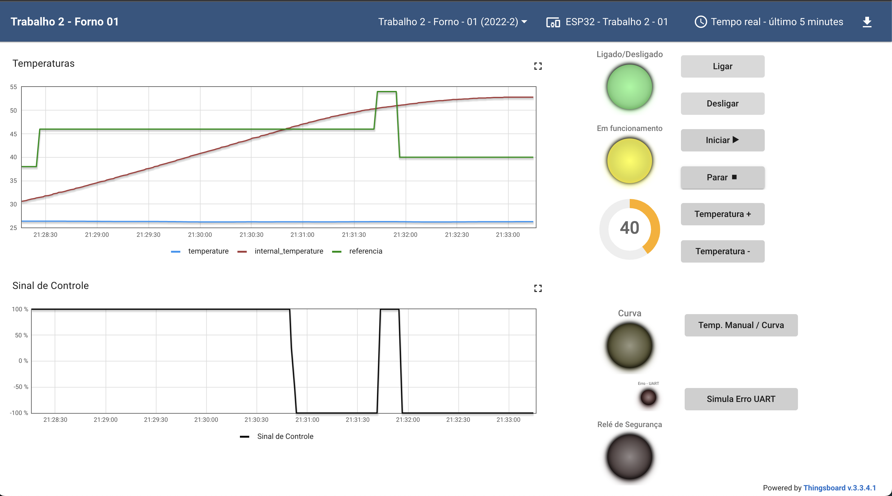
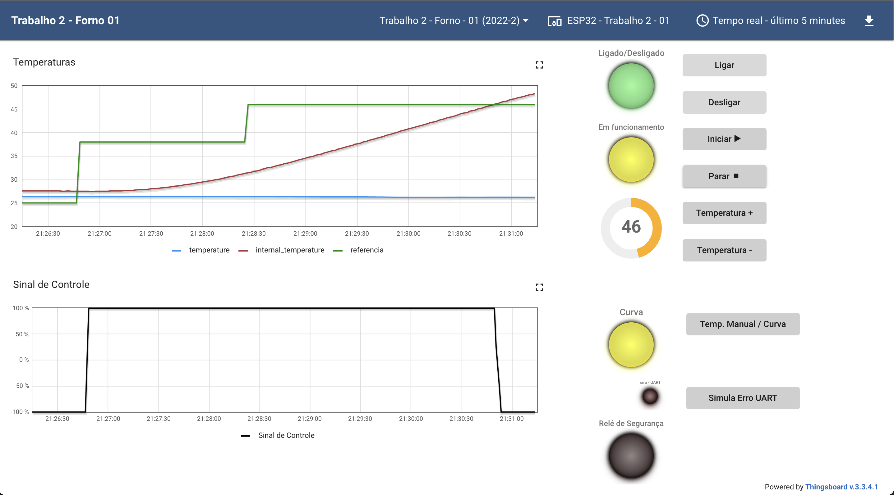
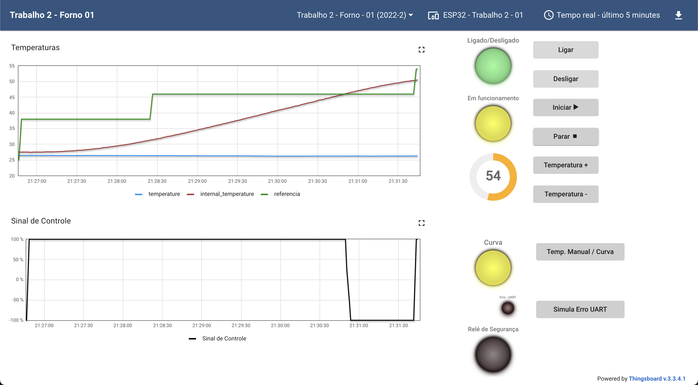

# Trabalho 02 (2022-2)
Trabalho 02 da disciplina de Fundamentos de Sistemas Embarcados (2022/2)

## Objetivo
Este trabalho tem por objetivo a implementação de um sistema (que simula) o controle de um forno para soldagem de placas de circuito impresso (PCBs).

Veja mais detalhes clicando [aqui](https://gitlab.com/fse_fga/trabalhos-2022_2/trabalho-2-2022-2).

## Dependências
Este trabalho foi desenvolvido usando a linguagem [Python](https://www.python.org/downloads/) em sua versão 3.
- Bibliotecas auxiliares:
    - [RPI.GPIO](https://pypi.org/project/RPi.GPIO/): Responsável por permitir acesso a placa.
    - [SMBUS2](https://pypi.org/project/smbus2/) e [BME280](https://pypi.org/project/bme280/): Responsáveis para acessar o sensor que retornará a temperatura ambiente.

## Detalhes da implementação
- O Projeto conta com a implementação de um sistema central que receberá comandos do usuário. 
- O Projeto está integrado com os valores retornados pela dashboard.
- O Projeto salva logs de hora, temperatura e porcentagem dos atuadores em um arquivo ".csv".
- O projeto tem as seguintes funcionalidades:
    - Controlador PID:
        * Que pode ser definido pelo usuário ou por valores padrões.
    - Modo de temperatura referencial
        * Que pode ser definido pela Dashboard, Manualmente ou pelo arquivo de curva_reflow. 
    - Ligar/Desligar forno
    - Iniciar/Parar aquecimento
    - Aumento/Diminuição da temperatura
    - Mudança do modo de temperatura pela Dashboard: 
        * Pode ser alterado entre Dashboard e Curva Reflow
    - Recebimento de Sinal de controle pela Dashboard

## Instruções/Como rodar 
- Acessar a placa responsável pela sala que será testada
    -   Para o exemplo do vídeo foi usado a RASP44 e FORNO 02
- Ter as dependências devidamente instaladas no ambiente de teste
- Acessar a pasta src
- Rodar a aplicação central:
```bash
    python3 server.py
```
- Selecionar o modo de valores para o PID e de tipo de temperatura. 

## Screenshots 
#### Dashboard com forno e acionamento ligados
https://user-images.githubusercontent.com/52058094/214090381-f030d424-1d85-4ce7-bc3c-5ec33ddc729c.mov

    - Gráfico com temperatura fixa




#### Dashboard com Curva Reflow
    - Mudança de temperatura referencial de 25 para 38 seguindo os dados do arquivo curva_reflow.
 
https://user-images.githubusercontent.com/52058094/214095270-94143975-dcf6-4a71-b25a-19737c9f8a5a.mov

    - Mudança de temperatura de 25 para 46 seguindo os dados do arquivo curva_reflow. 



    - Mudança de temperatura de 25 para 54 seguindo os dados do arquivo curva_reflow. 



#### Logs recebidos no Terminal
https://user-images.githubusercontent.com/52058094/214097258-e3ce7a11-049d-402f-8434-1911f06609db.mov

#### Logs recebidos na Live
https://user-images.githubusercontent.com/52058094/214097365-93c80656-db8d-42a5-a8da-0a2c1bff746f.mov

## Vídeo de apresentação
- Primeira opção: Acesse "youtube.com/watch?v=0YSraFGeBVg" para ver no youtube.
- Segunda opção: Clique [aqui](https://unbbr.sharepoint.com/sites/MinhasGravaes431/_layouts/15/stream.aspx?id=%2Fsites%2FMinhasGravaes431%2FDocumentos%20Compartilhados%2FGeneral%2FRecordings%2FTrabalho%2002%20%2D%20FSE%2D20230123%5F121931%2DMeeting%20Recording%2Emp4) para ver no Sharepoint.
- Terceira opção: O vídeo está disponível na pasta assets com o nome FSE-Trabalho02.mp4
